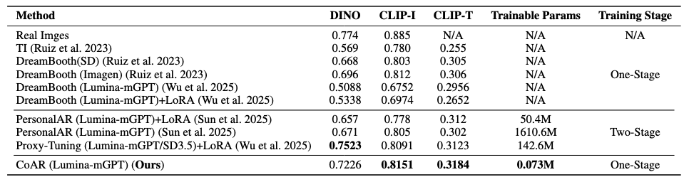

# CoAR
Concept Injection into Autoregressive Models for Personalized Text-to-Image Generation
[](https://arxiv.org/abs/2508.07341](https://arxiv.org/abs/2508.07341))

## 📌 TODO List
- [ ] Subject-driven inference scripts  
- [ ] Subject–style compositional inference scripts  
- [ ] Training scripts  

---

## 🔍 Overview
CoAR is a simple yet effective framework for injecting subject or style concepts into multi-modal autoregressive (AR) models without modifying any pretrained parameters. By leveraging a small set of **layer-wise multi-modal learnable tokens**, CoAR achieves high-quality, efficient customization for both subject-driven personalization and **training-free** subject-style compositional generation.

<p align="center">
  
</p>

---

## 📊 Qualitative Demo

<p align="center">
  
</p>

<p align="center">
  
</p>

<p align="center">
  
</p>

## 📈 Performance Comparison on DreamBench
<p align="center">
  
</p>

---

## 📝 Citation
```bibtex
@misc{wu2025coarconceptinjectionautoregressive,
      title={CoAR: Concept Injection into Autoregressive Models for Personalized Text-to-Image Generation}, 
      author={Fangtai Wu and Mushui Liu and Weijie He and Wanggui He and Hao Jiang and Zhao Wang and Yunlong Yu},
      year={2025},
      eprint={2508.07341},
      archivePrefix={arXiv},
      primaryClass={cs.CV},
      url={https://arxiv.org/abs/2508.07341}, 
}
