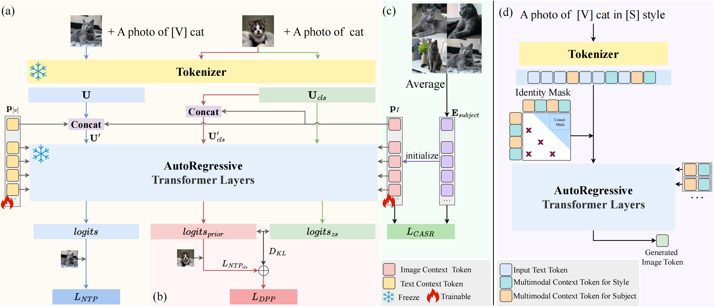

# CoAR
Concept Injection into Autoregressive Models for Personalized Text-to-Image Generation

## 📌 TODO List
- [ ] Subject-driven inference scripts  
- [ ] Subject–style compositional inference scripts  
- [ ] Training scripts  

---

## 🔍 Overview
CoAR is a simple yet effective framework for injecting subject or style concepts into multi-modal autoregressive (AR) models without modifying any pretrained parameters. By leveraging a small set of **layer-wise multi-modal learnable tokens**, CoAR achieves high-quality, efficient customization for both subject-driven personalization and subject-style compositional generation.

<p align="center">
  
</p>

---

## 📊 Demo

<p align="center">
  
</p>

<p align="center">
  
</p>

<p align="center">
  
</p>

## 📈 Performance Comparison on DreamBench

| Method | DINO | CLIP-I | CLIP-T | Trainable Params | Training Stage |
| --- | --- | --- | --- | --- | --- |
| **Real Images** | 0.774 | 0.885 | N/A | N/A | N/A |
| TI [[1]](#1) | 0.569 | 0.780 | 0.255 | N/A |  |
| DreamBooth (SD) [[1]](#1) | 0.668 | 0.803 | 0.305 | N/A |  |
| DreamBooth (Imagen) [[1]](#1) | 0.696 | 0.812 | 0.306 | N/A | One-Stage |
| DreamBooth (Lumina-mGPT) [[2]](#2) | 0.5088 | 0.6752 | 0.2956 | N/A |  |
| DreamBooth (Lumina-mGPT) + LoRA [[2]](#2) | 0.5338 | 0.6974 | 0.2652 | N/A |  |
| PersonalAR (Lumina-mGPT) + LoRA [[3]](#3) | 0.657 | 0.778 | 0.312 | 50.4M |  |
| PersonalAR (Lumina-mGPT) [[3]](#3) | 0.671 | 0.805 | 0.302 | 1610.6M | Two-Stage |
| Proxy-Tuning (Lumina-mGPT / SD3.5) + LoRA [[2]](#2) | **0.7523** | 0.8091 | 0.3123 | 142.6M |  |
| **CoAR (Lumina-mGPT) (Ours)** | 0.7226 | **0.8151** | **0.3184** | **0.073M** | One-Stage |

**Table:** Performance comparison of our CoAR and recent competitors on the DreamBench dataset. The best results are in **bold**.

---

## 📝 Citation
```bibtex
@article{YourPaper2025,
  title={CoAR: Concept Injection into Autoregressive Models for Personalized Text-to-Image Generation},
  author={...},
  journal={...},
  year={2025}
}
